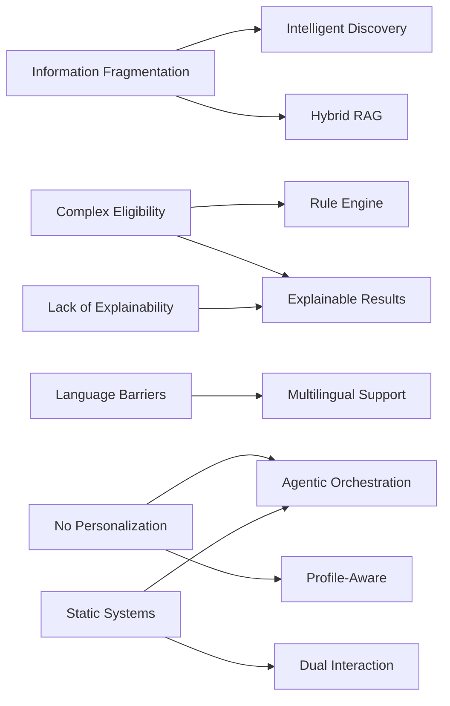
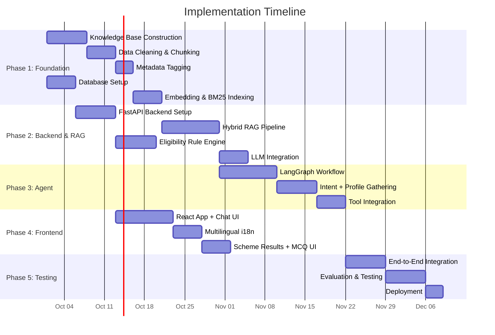
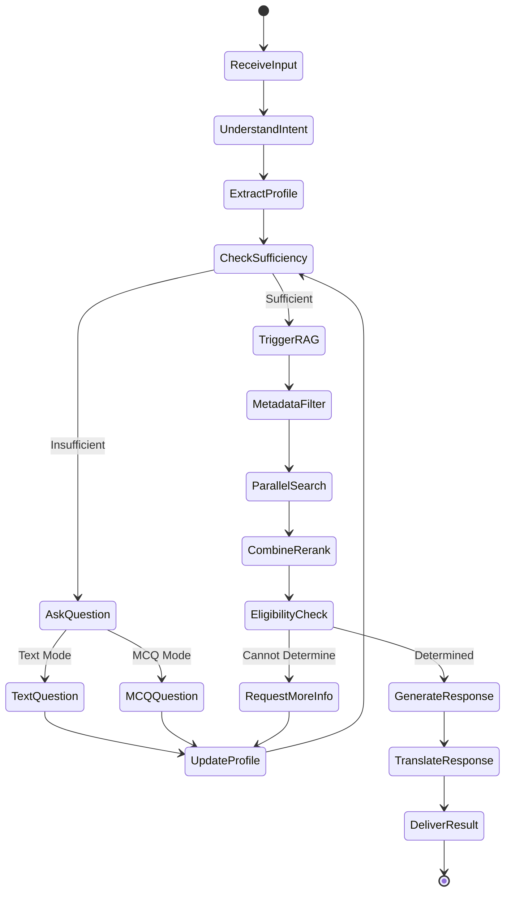
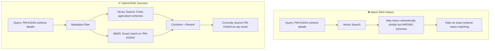
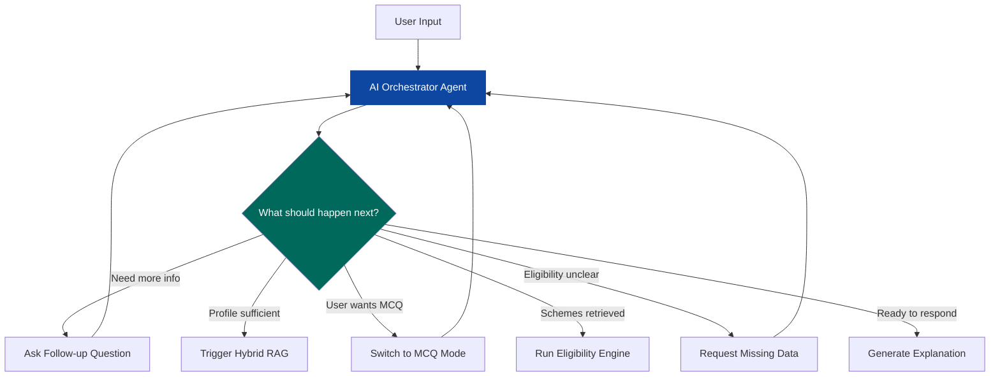

# Project Synopsis

## Agentic RAG-Based Government Scheme Recommendation Chatbot
**A Multilingual, Profile-Aware and Eligibility-Guided Government Scheme Assistance System**

---

## 1. Problem Statement

### 1.1 Background

India operates one of the largest welfare ecosystems in the world, with hundreds of government schemes administered across central, state, and local levels. These schemes span agriculture, education, healthcare, housing, social welfare, employment, and financial inclusion — targeting diverse beneficiary groups such as farmers, students, women, senior citizens, minorities, and economically weaker sections.

Despite the breadth of available schemes, a significant gap exists between **scheme availability** and **citizen awareness**. The primary reasons include:

### 1.2 Core Problem

> **Citizens struggle to discover government schemes relevant to their specific situation, understand their eligibility, and navigate the application process — due to fragmented information, complex eligibility criteria, language barriers, and the absence of a unified, intelligent assistance system.**

### 1.3 Specific Challenges

| # | Challenge | Description |
|---|-----------|-------------|
| 1 | **Information Fragmentation** | Scheme details are scattered across multiple government portals, PDFs, gazette notifications, and department websites with no single source of truth |
| 2 | **Complex Eligibility Criteria** | Each scheme has multi-dimensional eligibility rules involving age, income, occupation, state, caste category, gender, and more — making manual cross-matching impractical |
| 3 | **Language Barriers** | Most official scheme documentation is in English or formal Hindi, excluding users who are more comfortable in regional languages like Marathi |
| 4 | **No Personalized Guidance** | Existing portals (e.g., MyScheme) provide static search-based results without understanding the user's complete profile or asking intelligent follow-up questions |
| 5 | **Lack of Explainability** | Users receive lists of scheme names without understanding *why* a scheme is relevant, *which* conditions they meet, or *what* documents they need |
| 6 | **Static & Outdated Systems** | Current systems cannot dynamically gather missing information, adapt to user context, or provide conversational guidance |

### 1.4 Why Existing Solutions Fall Short

- **Government portals** offer keyword-based search but no conversational understanding
- **Simple chatbots** use rule-based flows (rigid decision trees) that cannot handle the diversity of user queries
- **Basic RAG chatbots** can retrieve information but cannot autonomously decide whether to ask follow-up questions, check eligibility, or request missing data
- **No existing system** combines profile awareness, hybrid retrieval, deterministic eligibility checking, and multilingual support in a single intelligent platform

### 1.5 Problem Statement (Formal)

> *"To design and develop a multilingual, profile-aware, AI-driven web-based chatbot that leverages an Agentic Hybrid RAG architecture to help Indian citizens discover relevant government schemes, understand their eligibility, and receive explainable, source-grounded recommendations — addressing the challenges of information fragmentation, complex eligibility evaluation, language barriers, and lack of personalized guidance in the current government scheme ecosystem."*

---

## 2. Objectives

### 2.1 Primary Objectives

| # | Objective | Description |
|---|-----------|-------------|
| **O1** | **Intelligent Scheme Discovery** | Enable citizens to discover relevant government schemes through natural language conversation rather than manual keyword search |
| **O2** | **Agentic Workflow Orchestration** | Implement an AI orchestrator agent using LangGraph that autonomously controls the workflow — understanding intent, gathering information, triggering retrieval, and coordinating responses |
| **O3** | **Hybrid RAG Retrieval** | Build a Hybrid RAG pipeline combining vector search, BM25 keyword search, metadata filtering, and reranking to achieve high-precision scheme retrieval |
| **O4** | **Deterministic Eligibility Checking** | Develop a Python-based rule engine for structured eligibility evaluation, distinguishing between Eligible / Not Eligible / Information Missing states |
| **O5** | **Explainable Recommendations** | Provide transparent, source-grounded scheme recommendations explaining relevance, matched/unmatched conditions, benefits, documents, and application procedures |
| **O6** | **Multilingual Support** | Support English, Hindi, and Marathi across the entire platform with language-neutral internal processing |
| **O7** | **Profile-Aware Interaction** | Maintain and progressively build user profiles across conversation turns to enable contextual and personalized recommendations |

### 2.2 Secondary Objectives

| # | Objective | Description |
|---|-----------|-------------|
| **S1** | **Dual Interaction Modes** | Support both free-form text conversation (default) and optional MCQ-guided interaction |
| **S2** | **Language Extensibility** | Design the architecture to support addition of more Indian languages without structural changes |
| **S3** | **Evaluation Framework** | Implement retrieval metrics (Precision@K, Recall@K, MRR) and response quality metrics (relevance, faithfulness, hallucination rate) |
| **S4** | **Source Grounding** | Ensure all scheme information is traceable to official/verified government sources |
| **S5** | **Scalable Architecture** | Build a modular, layered architecture that can scale to additional schemes, features, and interfaces |

### 2.3 Objective Mapping to Problem Challenges



---

## 3. Implementation Plan

### 3.1 System Architecture Overview


### 3.2 Technology Stack

| Layer | Technology | Purpose |
|-------|-----------|---------|
| **Frontend** | React + Vite | Single-page web application |
| **Styling** | Tailwind CSS | Responsive UI design |
| **Internationalization** | i18n Library | Multilingual UI (EN/HI/MR) |
| **Backend** | Python + FastAPI | REST API server |
| **Agent Framework** | LangGraph | Agentic workflow orchestration with state management |
| **RAG Framework** | LangChain | Retrieval pipeline construction |
| **Vector Database** | Qdrant | Dense vector similarity search |
| **Keyword Search** | BM25 (rank_bm25) | Sparse keyword-based retrieval |
| **Reranker** | BGE Reranker / Cross-Encoder | Result relevance reranking |
| **LLM** | Gemini API / OpenAI API | Language understanding and response generation |
| **Embeddings** | Multilingual Embedding Model | Vector representation of scheme documents |
| **Database** | PostgreSQL | Structured data storage (profiles, conversations, metadata) |
| **Version Control** | Git + GitHub | Source code management and collaboration |

### 3.3 Phase-Wise Implementation Plan

#### Phase 1: Foundation & Data Preparation (Weeks 1–3)

| Task | Details |
|------|---------|
| Knowledge Base Construction | Collect and structure government scheme data from official sources |
| Data Cleaning & Chunking | Clean scheme documents, create semantic/section-based chunks |
| Metadata Tagging | Attach structured metadata (state, category, beneficiary type, eligibility fields) |
| Database Setup | Set up PostgreSQL for application data and Qdrant for vector storage |
| Embedding Generation | Generate multilingual embeddings for all scheme chunks |
| BM25 Index Creation | Build BM25 keyword index for sparse retrieval |

#### Phase 2: Backend & RAG Pipeline (Weeks 3–6)

| Task | Details |
|------|---------|
| FastAPI Backend | Set up API server with authentication and session management |
| Hybrid RAG Pipeline | Implement metadata filtering → vector search + BM25 → RRF fusion → reranking |
| Eligibility Rule Engine | Build Python-based deterministic eligibility checker with rule definitions |
| Profile Management | Implement user profile creation, update, and persistence |
| LLM Integration | Integrate Gemini/OpenAI API for language understanding and response generation |

#### Phase 3: Agentic Orchestration (Weeks 5–8)

| Task | Details |
|------|---------|
| LangGraph Workflow | Implement the orchestrator agent with state management and conditional routing |
| Intent Recognition | Enable the agent to classify user intent from natural language |
| Information Gathering | Implement follow-up question logic and progressive profile building |
| Tool Integration | Connect agent to RAG pipeline, eligibility engine, and response generator |
| MCQ Mode | Implement optional MCQ-guided interaction as an agent interaction mode |

#### Phase 4: Frontend & Multilingual UI (Weeks 6–9)

| Task | Details |
|------|---------|
| React App Setup | Initialize React + Vite project with component architecture |
| Chat Interface | Build conversational UI with message history and streaming |
| Language Switcher | Implement EN/HI/MR language toggle with i18n |
| Profile Panel | Create user profile display and editing interface |
| Scheme Results UI | Design scheme recommendation cards with eligibility status, benefits, and documents |
| MCQ Interface | Build optional MCQ interaction component |

#### Phase 5: Integration, Testing & Deployment (Weeks 9–12)

| Task | Details |
|------|---------|
| End-to-End Integration | Connect frontend ↔ backend ↔ agent ↔ RAG ↔ eligibility engine |
| Retrieval Evaluation | Measure Precision@K, Recall@K, MRR on test queries |
| Response Evaluation | Assess relevance, faithfulness, hallucination rate |
| Eligibility Testing | Validate rule engine accuracy with test user profiles |
| Multilingual Testing | Verify consistent behavior across English, Hindi, and Marathi |
| Performance Optimization | Optimize response latency and retrieval speed |
| Deployment | Deploy the application to production environment |

### 3.4 Implementation Timeline (Gantt Chart)



---

## 4. System Flowchart

### 4.1 Complete System Flowchart


### 4.2 Flowchart Explanation

The system flowchart illustrates the end-to-end interaction flow:

1. **User Entry**: The user selects their preferred language (English, Hindi, or Marathi) and enters a query or starts a chat conversation.

2. **AI Orchestrator Agent**: The LangGraph-based orchestrator receives the input and begins processing.

3. **Intent & Profile Extraction**: The agent understands the user's intent and extracts any profile information (age, income, state, occupation, etc.) from the conversation.

4. **Information Sufficiency Check** (Decision Point):
   - **If insufficient** → The agent determines whether the user prefers MCQ mode or text mode, then asks relevant follow-up questions to gather missing information. The user's profile is updated after each response, and the sufficiency check is repeated.
   - **If sufficient** → The agent triggers the Hybrid RAG pipeline.

5. **Hybrid RAG Pipeline**: The query (enriched with profile context) is processed through:
   - Metadata pre-filtering (state, category, beneficiary type)
   - Parallel Vector Search (Qdrant) and BM25 Keyword Search
   - Score combination and reranking

6. **Eligibility Evaluation**: Candidate schemes are passed to the Python-based rule engine.
   - If eligibility cannot be determined (missing information), the agent loops back to request more data.
   - If eligibility is determined, schemes are classified as Eligible / Not Eligible / Partially Eligible.

7. **Response Generation**: The LLM generates an explainable recommendation in the user's selected language, grounded in retrieved scheme information.

### 4.3 Agentic Workflow Detail (State Machine)



---

## 5. Justification of RAG Type: Why Hybrid RAG?

### 5.1 Overview of RAG Approaches

Retrieval-Augmented Generation (RAG) is a paradigm that enhances LLM responses by grounding them in retrieved external knowledge. Different RAG architectures offer varying levels of capability:


### 5.2 RAG Types Compared

| RAG Type | Architecture | Strengths | Weaknesses | Suitability for This Project |
|----------|-------------|-----------|------------|------------------------------|
| **Naive RAG** | Query → Vector Search → LLM | Simple to implement; captures semantic meaning | Misses exact keywords; no metadata filtering; no reranking | ❌ **Insufficient** — fails on exact terms like scheme names, income limits, state names |
| **Advanced RAG** | Query → Pre/Post Processing → Vector Search → LLM | Better query optimization; adds pre-retrieval and post-retrieval stages | Still relies on a single retrieval path (vector only) | ❌ **Partially suitable** — improves quality but cannot match exact terms reliably |
| **Modular RAG** | Multiple interchangeable modules (retrievers, generators, routers) | Highly flexible; each module is independently configurable | Over-engineered complexity; harder to maintain; adds latency | ⚠️ **Over-engineered** — unnecessary complexity for structured scheme data |
| **Hybrid RAG** | Metadata Filter → Vector + BM25 → Fusion → Reranker | Combines semantic + keyword retrieval; metadata narrowing; reranking | Slightly more complex than naive RAG | ✅ **Best fit** — matches all requirements of this domain |

### 5.3 Why Hybrid RAG is the Optimal Choice

Government scheme data has a unique dual nature — it contains both **natural-language descriptions** and **strict structured terms**. This dual nature makes Hybrid RAG the only appropriate choice:

#### Reason 1: Semantic Understanding via Vector Search

Users ask questions in natural language:
> *"I am a farmer looking for financial help for my crops"*

Vector search (using multilingual embeddings in Qdrant) understands the **semantic meaning** and retrieves agriculture-related schemes even if the exact word "farmer" doesn't appear in the scheme document — for example, a scheme mentioning "agriculturist" or "कृषक" would still be matched.

#### Reason 2: Exact Term Matching via BM25

Government scheme data contains **precise terms that must be matched exactly**:

| Term Type | Examples |
|-----------|----------|
| Scheme Names | "PM-KISAN", "Ladli Behna Yojana", "PMAY" |
| State Names | "Maharashtra", "Uttar Pradesh" |
| Income Limits | "₹5,00,000", "₹2.5 lakh" |
| Age Limits | "18–35 years" |
| Document Names | "Aadhaar Card", "Domicile Certificate" |
| Category Terms | "SC/ST", "OBC", "EWS" |

Vector search alone may fail to surface results when the user queries by exact scheme name or specific income threshold. BM25 keyword search excels at these **lexical matches**.

#### Reason 3: Metadata Pre-Filtering

Before any search is performed, metadata filters can narrow the search space:

```text
User Profile:
  State = Maharashtra
  Category = Farmer
  Scheme Level = State

→ Filter: Only search Maharashtra state schemes tagged with agriculture/farming
→ Dramatically reduces irrelevant results
→ Improves both precision and speed
```

This is critical because a scheme meant for Kerala farmers is irrelevant to a Maharashtra farmer, regardless of semantic similarity.

#### Reason 4: Reranking for Precision

After combining results from both retrievers using Reciprocal Rank Fusion (RRF), a cross-encoder reranker performs **deep pairwise relevance scoring** between the query and each candidate. This ensures the final Top-K results are ordered by true relevance rather than raw similarity scores.

### 5.4 Hybrid RAG Retrieval Pipeline (Detailed)


### 5.5 Concrete Example

Consider the following user query:

> *"मैं महाराष्ट्र का 25 साल का किसान हूं, मेरी आय ₹3 लाख है। मेरे लिए कौन सी योजनाएं हैं?"*
> *(I am a 25-year-old farmer from Maharashtra with income ₹3 lakh. What schemes are available for me?)*

| Pipeline Stage | What Happens |
|----------------|--------------|
| **Query Processing** | Language detected as Hindi → normalized to internal representation; profile fields extracted: `age=25, state=Maharashtra, occupation=farmer, income=300000` |
| **Metadata Filter** | Search space narrowed to: Maharashtra state schemes + Central schemes applicable to Maharashtra + Agriculture/farming category |
| **Vector Search** | Finds schemes semantically related to "farming assistance", "agricultural subsidy", "crop insurance", "rural livelihood" |
| **BM25 Search** | Matches exact terms: "Maharashtra", "farmer", "₹3,00,000", "agriculture", "किसान" |
| **RRF Fusion** | Combines and normalizes scores from both retrievers |
| **Reranker** | Reorders results — schemes matching age ≤ 25, income ≤ 3L, farmer, Maharashtra rank highest |
| **Output** | Top-K most relevant scheme chunks passed to eligibility engine |

### 5.6 Why Other RAG Types Would Fail Here



### 5.7 Summary: Justification Matrix

| Requirement | Naive RAG | Advanced RAG | Modular RAG | Hybrid RAG |
|-------------|:---------:|:------------:|:-----------:|:----------:|
| Semantic understanding of natural language queries | ✅ | ✅ | ✅ | ✅ |
| Exact matching of scheme names and terms | ❌ | ❌ | ✅ | ✅ |
| Metadata-based filtering (state, category) | ❌ | ⚠️ | ✅ | ✅ |
| Reranking for precision | ❌ | ✅ | ✅ | ✅ |
| Multilingual retrieval | ⚠️ | ⚠️ | ✅ | ✅ |
| Reasonable implementation complexity | ✅ | ✅ | ❌ | ✅ |
| Profile-aware query enrichment | ❌ | ⚠️ | ✅ | ✅ |
| **Overall Suitability** | **Low** | **Medium** | **Medium-High** | **High ✅** |

> [!IMPORTANT]
> **Conclusion**: Hybrid RAG is selected because it uniquely combines semantic understanding (vector search) with exact term matching (BM25), structured metadata filtering, and relevance reranking — all of which are essential for accurately retrieving government scheme information. Neither pure vector search nor pure keyword search alone can handle the dual nature (natural language + strict terms) of government scheme data.

---

## 6. Key Innovation: Agentic Architecture

### 6.1 What Makes This System "Agentic"?

The system is not merely a chatbot with RAG — it is an **agent-controlled workflow** where the AI orchestrator autonomously makes decisions about what action to take next:



### 6.2 Agent vs. Non-Agent Comparison

| Aspect | Non-Agentic Chatbot | This Agentic System |
|--------|---------------------|---------------------|
| **Flow Control** | Fixed pipeline — every query goes through the same steps | Agent decides the next step based on current state |
| **Missing Information** | Returns incomplete results or errors | Asks targeted follow-up questions |
| **Profile Awareness** | No memory across turns | Maintains and builds user profile progressively |
| **Eligibility** | LLM guesses eligibility | Deterministic rule engine evaluates eligibility |
| **Explainability** | Returns scheme names | Explains *why* each scheme is relevant |
| **Interaction Mode** | Single mode only | Supports text + optional MCQ |

---

## 7. Evaluation Strategy

| Dimension | Metrics | Target |
|-----------|---------|--------|
| **Retrieval Quality** | Precision@5, Recall@10, MRR | Precision@5 ≥ 0.7 |
| **Response Quality** | Relevance, Faithfulness, Context Relevance | Faithfulness ≥ 0.85 |
| **Hallucination Control** | Hallucination Rate | ≤ 5% |
| **Eligibility Accuracy** | Correct eligibility determination | ≥ 90% |
| **Missing Info Handling** | Correct detection of incomplete profiles | ≥ 95% |
| **Response Latency** | End-to-end response time | ≤ 5 seconds |
| **Multilingual Quality** | Equivalent response quality across EN/HI/MR | No significant degradation |

---

## 8. Scope & Constraints

### 8.1 In Scope (MVP)

- Multilingual web application (English, Hindi, Marathi)
- Text-based conversational chatbot with optional MCQ mode
- Single AI orchestrator agent (LangGraph)
- Hybrid RAG pipeline (Vector + BM25 + Metadata + Reranking)
- Python-based eligibility rule engine
- Explainable, source-grounded recommendations
- User profile management
- PostgreSQL + Qdrant data storage

### 8.2 Out of Scope (Future Extensions)

- Voice interaction
- WhatsApp / mobile app interface
- Document upload and OCR verification
- Automatic knowledge base updates
- Scheme comparison dashboard
- Push notifications and reminders

### 8.3 Constraints

- All scheme information must be sourced from official/verified government sources
- The system must not invent eligibility criteria, benefits, documents, or URLs
- Eligibility logic must be deterministic (rule-based), not LLM-dependent
- MCQ mode must remain optional — never forced on users
- The system must clearly indicate when information is missing or unverifiable
